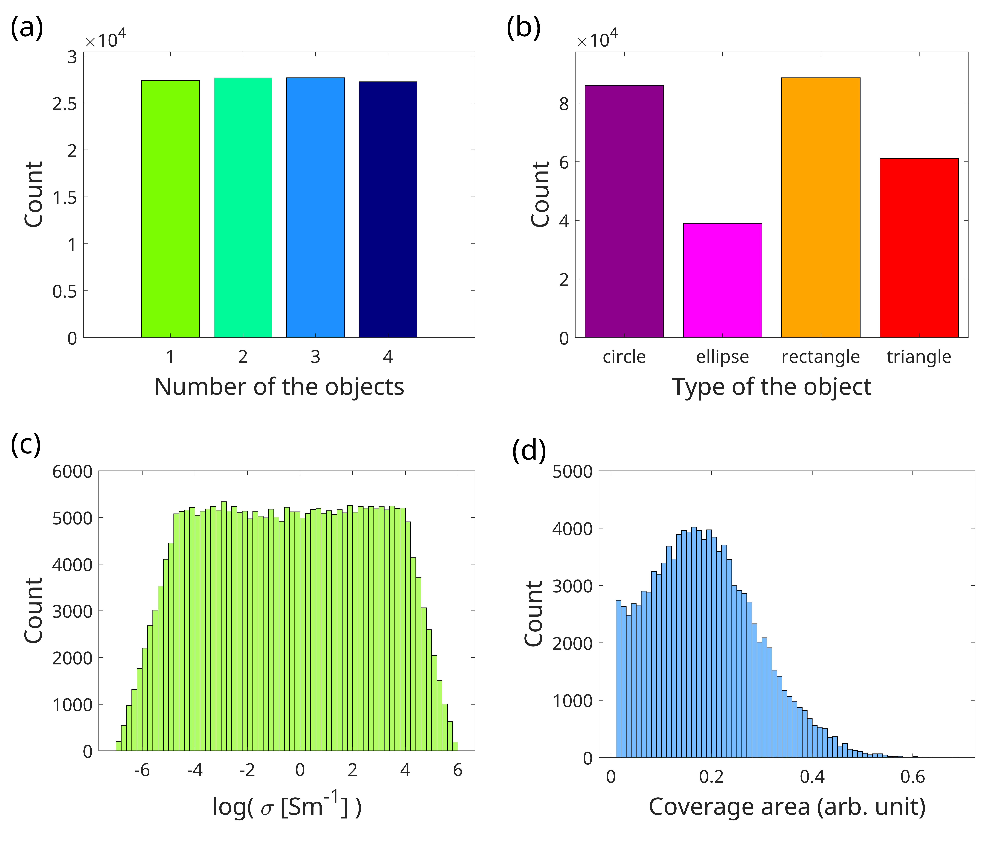
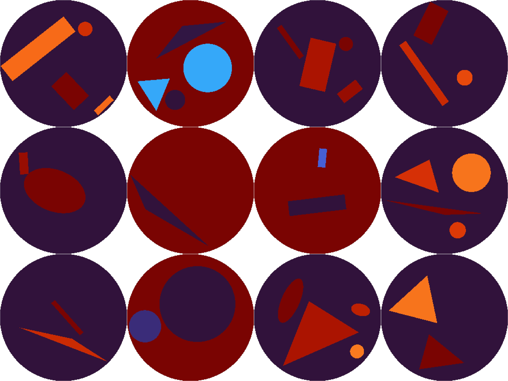
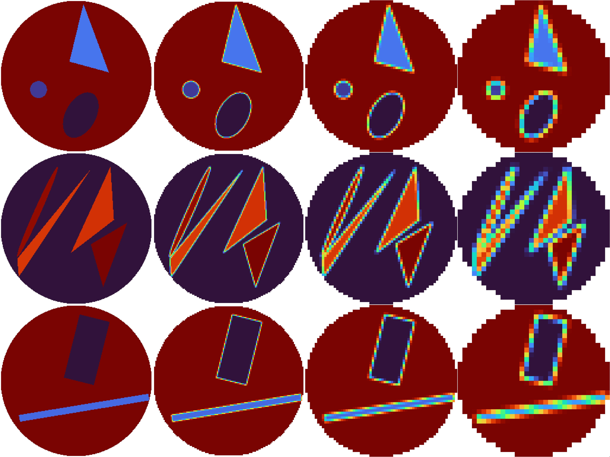

# SimEIT: A Scalable Simulation Framework for Generating Large-Scale Electrical Impedance Tomography Datasets

## Authors
- Ayman A. Ameen<sup>1</sup>, Franziska Mathis-Ullrich<sup>1</sup>, Bernhard Kainz<sup>1,2</sup>

<sup>1</sup>Friedrich-Alexander University Erlangen-Nürnberg  
<sup>2</sup>Imperial College London  

---

A scalable MATLAB-based framework for generating large-scale, physically consistent Electrical Impedance Tomography (EIT) datasets using EIDORS. This repository contains the SimEIT framework and includes two large-scale synthetic EIT datasets, providing a complete solution for creating AI-ready training data with physically consistent simulations.

## Abstract

Electrical Impedance Tomography (EIT) offers advantages over conventional imaging methods, such as X-ray and MRI, but suffers from an ill-posed inverse problem. Deep learning can alleviate this challenge, yet progress is limited by the lack of large, diverse, and reproducible datasets. We present SimEIT, a scalable framework for deterministic simulation and generation of synthetic EIT data. SimEIT enables high-throughput creation of diverse geometries and conductivity maps using parallelized finite element simulations, reproducible seeding, and automated validation. The framework provides multi-resolution, AI-ready HDF5 outputs with PyTorch integration. Demonstrated on two datasets exceeding 100,000 samples, SimEIT bridges the gap between physical simulation and AI training, supporting reliable benchmarking and development of advanced reconstruction algorithms.

## Overview

Electrical Impedance Tomography (EIT) offers advantages over conventional imaging methods, such as X-ray and MRI, but suffers from an ill-posed inverse problem. Deep learning can alleviate this challenge, yet progress is limited by the lack of large, diverse, and reproducible datasets. 

To address this critical gap, we introduce **SimEIT**: an open-source, parallelized framework for generating large-scale, physically consistent EIT datasets. Built on the validated EIDORS engine, SimEIT integrates flexibility, reproducibility, and scalability through several key innovations:

- **Modular Framework & Parallel Processing**: Flexible architecture with interchangeable components enables parallel execution in geometry generation and simulation stages, overcoming scalability bottlenecks.
- **Geometry-Boundary Flexibility**: Parametric customization of inclusion shapes (*e.g.*, circles, ellipses, triangles), conductivity distributions, electrode placements, and domain boundaries (*e.g.*, spherical substrates).
- **Reproducible High-Throughput Synthesis**: Deterministic seed control ensures batch-wise traceability for large-scale, physically accurate data generation.
- **AI-Ready Data Optimization**: Multi-resolution ground-truth maps (*e.g.*, 256x256 to 32x32), differential outputs, and metadata-linked HDF5 storage with PyTorch integration.
- **EIDORS-Based Physical Fidelity**: Maintains physical consistency while supporting MATLAB and open-source Octave environments.
- **Open Ecosystem & Visualization**: Public codebase, Hugging Face demos, configurable noise models, and visualization tools enable community-driven expansion and validation.

By democratizing large-scale EIT data synthesis, SimEIT accelerates inverse solver development, enables systematic study of ill-posedness origins, and establishes a foundation for reproducible AI advancements in the field, launching the realization of the EIT promise across medical, industrial, and scientific domains.

## Key Features
- Modular MATLAB pipeline built on EIDORS
- Deterministic, large-scale dataset generation
- Configurable via a single `config.yaml`
- Experimental data integration (optional)
- Parallel-friendly patch/batch processing
- HDF5/MAT/CSV outputs and plotting utilities
- Multi-resolution output support (256×256, 128×128, 64×64, 32×32)
- PyTorch DataLoader integration

## Examples of Generated Datasets

Access the pre-generated datasets on Hugging Face:
https://huggingface.co/datasets/AymanAmeen/SimEIT-dataset

To visualize and explore the datasets online, visit our Hugging Face Spaces demo:
https://huggingface.co/spaces/AymanAmeen/SimEIT-demo

### File Formats
- **HDF5**: AI-ready format with PyTorch integration
- **CSV files**: Metadata and sample parameters
- **MAT files**: MATLAB-compatible data structures for masks and voltage measurements
- **XLS files**: Mask definitions at various resolutions

## Dataset Statistics and Samples

The statistical properties of the generated dataset, summarized in the figures below, confirm its controlled diversity. The number of inclusions per sample is uniformly distributed from one to four, ensuring balanced complexity. The distribution of shapes is varied, with rectangles and circles being most frequent. Inclusion conductivities follow a near-uniform logarithmic distribution, offering a wider range than typical phantoms. The fractional area covered by objects is right-skewed, prioritizing samples with lower object density while still including high-density cases.


*Figure: Statistical analysis of the dataset showing (a) number of inclusions distribution, (b) shape type frequencies, (c) conductivity value distributions, and (d) fractional area coverage.*

### Sample Geometries and Shapes

Our framework procedurally generates EIT datasets with morphological diversity. Each sample represents a circular domain containing randomized inclusions of circles, triangles, rectangles, and ovals with heterogeneous sizes, orientations, and spatial distributions. Conductivity values σ follow a logarithmic distribution spanning multiple orders of magnitude, creating challenging physical scenarios.


*Figure: Example inclusion geometries and conductivity distributions. Each domain shows unique configurations of shapes with varying sizes, orientations, arrangements, and conductivity values (color-coded).*

### Multi-Resolution Dataset Structure

To accommodate different computational requirements, conductivity maps are generated at 256×256 pixel resolution and downsampled to 128×128, 64×64, and 32×32 resolutions. A PyTorch DataLoader integrates these datasets into deep learning workflows, while built-in circular masks exclude extraneous regions outside the EIT domain boundary, ensuring only relevant pixels are processed.


*Figure: Multi-resolution conductivity maps showing the same sample at different pixel resolutions (256×256, 128×128, 64×64, and 32×32).*

### Detailed Dataset Statistics

The FourObjects dataset includes comprehensive statistical analysis:
- Conductivity distributions across multiple objects
- Coverage area statistics
- Number and types of objects per sample
- Detailed visualizations available in `FourObjects/metadata/plot/`

---

## Requirements
- MATLAB R2021b+ (tested with R2025b) / GNU Octave (limited support)
- EIDORS included in `eidors/` (provided here)
- Linux/macOS/Windows

Optional:
- SLURM for batch run with `launch_patch.sh` -> create a single patch per job -> aggregate later
- combine_and_down_scale.sh -> combine all patches and downscale large images to multiple resolutions then save as HDF5

## Quick Start
1) Clone the repository
2) Edit `config.yaml` to set your generation parameters
3) Run the main script in MATLAB

### A) Run in MATLAB desktop
- Open MATLAB in the repo folder
- Ensure MATLAB has write permissions to create `dataset/`
- Run:

```matlab
% In MATLAB Command Window
run('generate_dataset.m') # for single patch generation
run('combine_and_down_scale.sh') % to combine patches and downscale
```

### B) Run headless (e.g., on a server)
- With a properly configured MATLAB module, you can use the provided launcher:

```bash
bash launch_patch.sh # repeat as needed for multiple patches
bash combine_and_down_scale.sh # to combine patches and downscale
```

## Configuration (config.yaml)
All knobs live in `config.yaml`. Key sections:

- general
  - mode: `simulation`, `simulation_test`, or `experimental`
- model
  - electrodes_num, resolution, domain shape, etc.
- dataset
  - number_of_samples, local_patch_size, patch_number, object_types, etc.
- conductivity
  - background value, log-space ranges, and experimental bias
- experimental
  - folder_experimental, list_of_data
- output
  - base_dir, which formats to save

Example defaults (see full file for more):

```yaml
general:
  mode: 'simulation'
model:
  electrodes_num: 16
  resolution: 256

dataset:
  number_of_samples: 5000
  local_patch_size: 100

conductivity:
  background_conductivity: 1.0
```

## How it works
- `generate_dataset.m` orchestrates the run:
  - Sets MATLAB paths
  - Loads `config.yaml`
  - Initializes homogeneous model and Jacobian via EIDORS
  - Creates or resumes dataset indexing (patch-based)
  - Generates patches with `generate_patch.m`

- `data_functions/` contains CSV generation, feature sampling, and config loader (`load_config.m`).
- `generate_functions/` contains mesh/model and solver utilities.
- `plots/` contains visualization helpers.

## Outputs
- `dataset/` is created alongside the repo (one level up) containing:
  - `metadata/` (voltages, homogeneous model, indices)
  - `MAT/<electrode_count>/` batch `.mat` files with generated samples
  - Optional CSV/HDF5 depending on config

## Common tweaks
- Change the number of electrodes: `config.model.electrodes_num`
- Change image resolution: `config.model.resolution`
- Change dataset size: `config.dataset.number_of_samples`
- Switch to experimental mode: `config.general.mode: experimental` and set `config.experimental.*`

## Troubleshooting
- Permission denied writing `dataset/`: ensure MATLAB can write to the parent directory.
- EIDORS not found: verify `eidors/startup.m` exists and loads correctly (the script calls it).
- Parallel performance: increase patch size (`dataset.local_patch_size`) to amortize overhead.

## License for EIDORS
This repository includes EIDORS (see `eidors/license.txt`)

---

## Citation

If you use SimEIT in your research, please cite:

```bibtex
@article{ameen2025simeit,
  title={SimEIT: A Scalable Simulation Framework for Generating Large-Scale Electrical Impedance Tomography Datasets},
  author={Ameen, Ayman A. and Mathis-Ullrich, Franziska and Kainz, Bernhard},
  year={2025},
}
```
